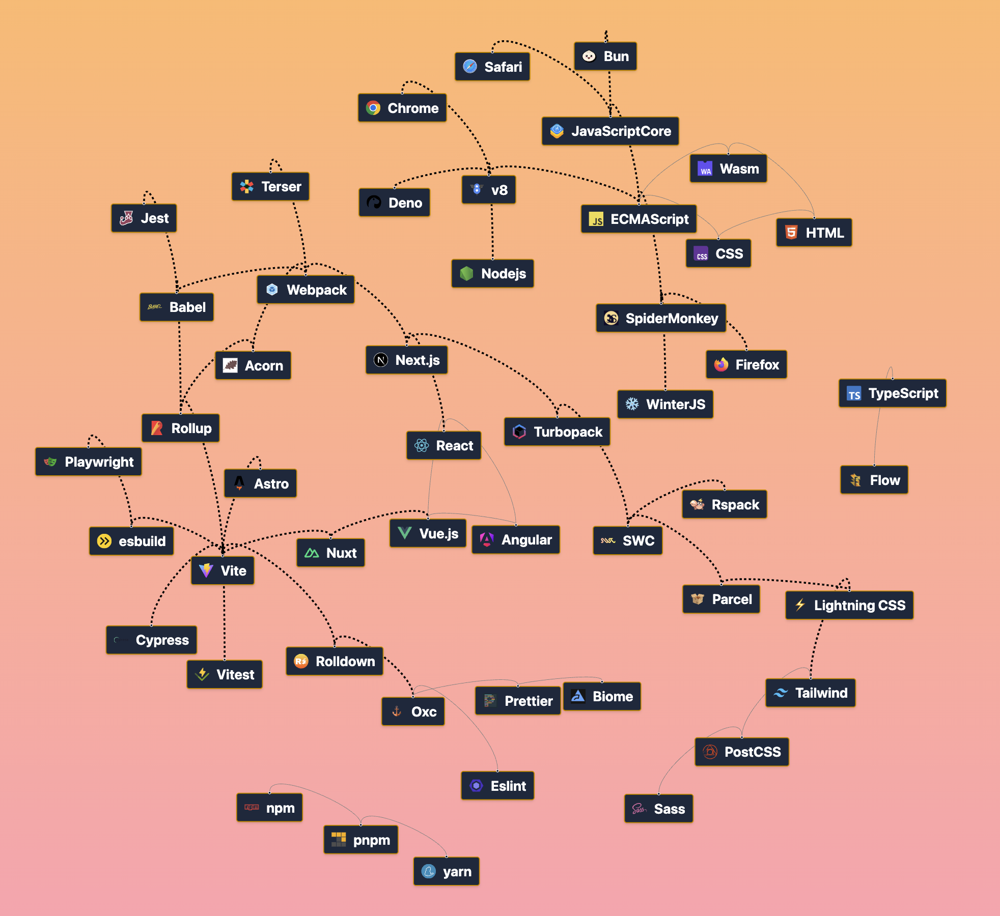

# Frontend Tooling Overview

See [https://frontend-tooling-overview.netlify.app](https://frontend-tooling-overview.netlify.app/)

---

## What is it?

This is a visual representation of some of the most common tools and
technologies used in frontend development.

Frontend tooling is a vast world: there are many tools with different
approaches available. **This visual representation aims to help understand what different
categories of tools exist, which categories common well-known tools
belong to, and how they interact with each other.**

The tools are categorized by their purpose and are connected to each
other to show how they interact.

_Disclaimer: This is a simplified representation, and some tools and/or
links might be purposely missing to keep the visual representation
clear._
